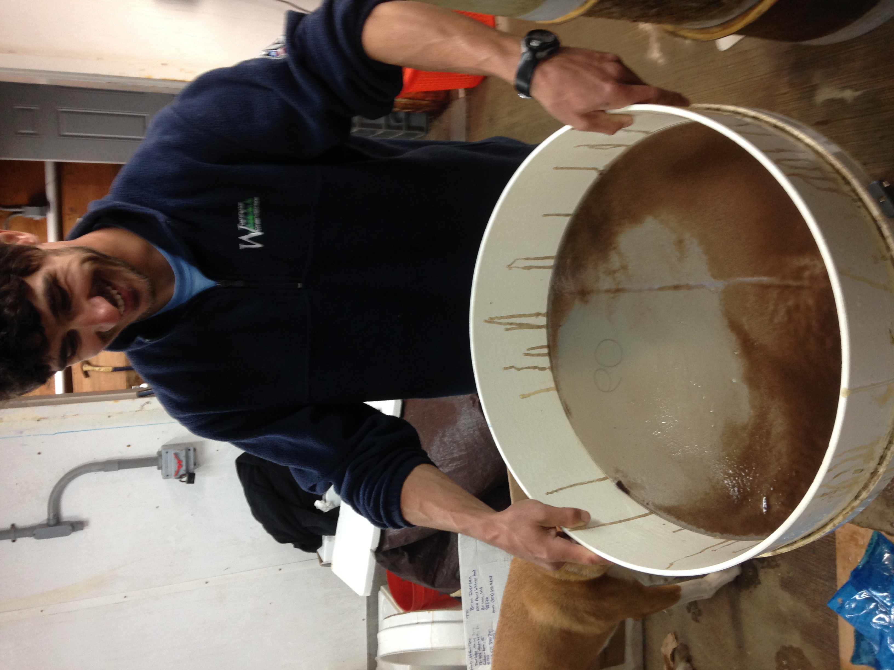
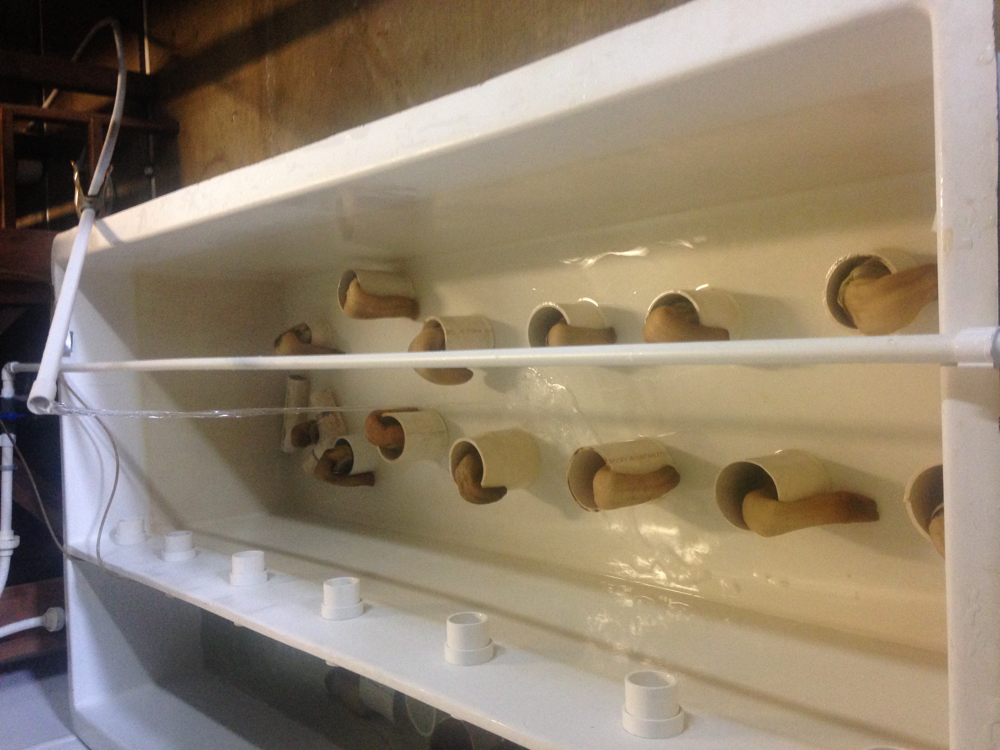
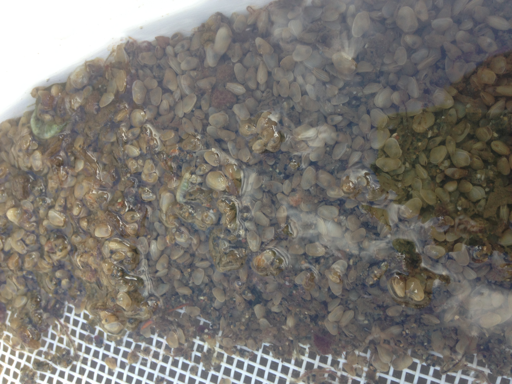

  <!-- MDTOC maxdepth:6 firsth1:0 numbering:1 flatten:0 bullets:1 updateOnSave:0 -->
# **Pacific Geoduck Aquaculture Handbook**
## **Table of Contents**
  - 1. [About](#About)
      - 1.1. [Background](#Pacific-geoduck-Panogea-generosa)
      - 1.2. [Purpose of this handbook](#Why-Read-this-Handbook?)
  - 2. [General Practices](#I--General-Rearing-Practices)
      - 2.1. [Hatchery Overview](#I.1.-The-hatchery)
      - 2.2. [Broodstock Conditioning & Natural Spawning](#I.2.-Broodstock-Conditioning-&-Natural-Spawning)
      - 2.3. [Larvae and Seed](#I.3-Larvae-and-Seed)
  - 3. [Strip Spawning](#II.-Strip-spawning)
      - 3.1. [General Procedure](#II.1.-General-Procedures)
      - 3.1. [General Procedure](#II.2.-Takeaways-for-Aquaculture)
  - 4. [Climate Change & Aquaculture](#III-Climate-Change-&-Aquaculture)
      - 4.1 [Ocean Acidification](#III.1.-Ocean-Acidification)
      - 4.2 [Future Solution: Stress Priming](#III.2.-Future-Solution:-Stress-Priming)
        - 4.2.1 [Broodstock](#Broodstock)
        - 4.2.1 [Larvae and Juveniles](#Larvae-and-Juveniles)
      - 4.3 [Summary of Our Findings](#III.3-Initial-Tests-&-Results)
      - 4.4 [Takeaways for Aquaculture](#IV.4-Takeaways-for-Aquaculture)

# **About**
Obj: Our research aims to understand the effects of environmental stress on sustainable production of the Pacific geoduck clam.
This document summarizes our collaborative research and
describes how are findings are applied to aquaculture industry.

  > *BACKGROUND*

## **Pacific geoduck *Panogea generosa***
Long-lived infaunal clam (records up to 168 years-of-age) of commercial and ecological importance with a native range from Alaska to Baja, California.

Commercial harvest and aquaculture of geoduck constitutes 27% of the overall shellfish revenue in Washington state and 90% of the global supply

Production of Pacific geoduck in the Pacific Northwest has elevated to satisfy increasing global demand.

## **Why Read this Handbook?**

# **I. General Rearing Practices**
about here!

## **I.1. The hatchery**

Reproduction and early development of shellfish are pivotal life stages
The success of a producer is largely dependent on limitations within the hatchery
and experience of its personnel.

## **I.2. Broodstock Conditioning & Natural Spawning**
Broodstock are adult animals either grown or collected for spawning in hatcheries.

## **I.3 Larvae and Seed**
about here!

# **II. Strip spawning**
A major artifact of geoduck aquaculture is the **spontaneous and opportunistic nature of natural spawning events**. For example, an unplanned nighttime natural spawn of a female geoduck set the stage for the growing season at Jamestown Point Whitney Shellfish Hatchery in winter 2019 (*Mat Henderson, personal communication*). Millions of eggs (~30) were released into a single broodstock tank with two dozen other animals (of unknown sex) and under seawater flow-though. In an optimal scenario, technicians would have isolated the spawning female to a static tank to control spawning/fertilization and maximize  egg yield. This event lead to a totally autotomous fertilization process outside of standard 9:00am - 5:00pm work hours. In most cases, spontaneous and unplanned spawning presents major loss in potential profit - luckily, personnel at JPWSH live on site and were able to salvage fertilized embryos.

Losses in production and profit are unfortunately common in shellfish aquaculture. In the story stated above, aquaculture technicians were limited by two main factors:
- **sex identification of broodstock**: The sex is unknown to hatchery personnel and is only revelead once an individual begins spawning.
- **reproductive status of broodstock**: Wild broodstock are typically collected in early winter and are fed algae-rich diets at the hatchery for several weeks/months to assume an optimal reproductive state. However, the timing to start controlled spawning attempts remains poorly understood.

#### We deployed new techniques to track adult geoduck

Trait  | Importance in Aquaculture | Technique | Note
------------- | ------------- | ---------- | ----|
**Sex of broodstock groups** | avoid spontaneous spawning and fertilization; enhance control of spawning attempts | **gonad biopsy** | invasive sub-lethal
|  |   |   |
**Reproductive status** | determine optimal timining for spawning; identify individuals to focus spawning efforts; control and increase diversity| **qPCR vitellogenin**, **gonad biopsy** | minimially invasive; invasive sub-lethal

## **II.1. General Procedures**
about here!

## **II.2. Takeaways for Aquaculture**
associated costs wiith invasive/minimially invasive techniques for reprodutive status

# **III Climate Change & Aquaculture**
about here!

## **III.1. Ocean Acidification**
>  *A BOTTLENECK FOR SHELLFISH PRODUCERS*

**The Pacific Northwest Seedstock Crisis:**

Hatchery losses in recent years due to ocean acidification demand investigation of adaptive resilience to anthropogenic stressors

 > *THE SOLUTIONS*

## **III.2. Future Solution: Stress Priming**
> *WHAT DOES NOT KILL YOU MAKES YOU STRONGER?*

#### **What does this mean?**

### **Broodstock**

### **Larvae and Juveniles**

## **III.3 Initial Tests & Results**

Life stage  | Treatment | measurement | response
------------- | ------------- | ---------- | ----------
Broodstock  | 7.8 (ambient) v. constant 6.8 v. oscillating 6.8| survival     |  -  |
  |  fecundity / reproductive success  | - |  -   |  -  |
gametes (egg and sperm)                | - |  lipid index   |  -  |
                                      |  -  |  - | -   |
larvae (D-hinge)                       | - |  -   |  -   |
larvae (pediveligers)                  | - |  -   |  -   |
juveniles (5-10 months)                | pH  = 7.8 (ambient) v. 7.2; Ω arag sat. = 1.3 v. 0.4 | survival   |   no mortality after repeated short-term exposures (6 - 10 days)  |
                                       | - |  metabolism    |  initial 25% decrease, **able to recover** and cope with short-term stress; evidence of **"memory" and positive carry over** later in life  |
                                       | - |  shell growth    |  initial decrease 3.6% length, but **compensatory growth** reveals benefits of early life exposure  |
juveniles (3-6 months)                 | - |  -   |  -  |  -  |

## **IV.4 Takeaways for Aquaculture**

# Stress conditioning for aquaculture enhancement
> *HOW CAN STRESS EXPOSURE BENEFIT AQUACULTURE?*
#### Review the following terms
##### Ecophysiology:

##### Plasticity:
###### a.) phenotype(s)
Broadly defined as **physical traits** expressed by an organism. These traits are reffered to as **"plastic"** becasue of they can **change in response to the envrionment.** Scientists are now engaged in **phenotypic plasticity** to study the  impact of envrionmental conditions and human disturbances  on the fitness and performance of organisms (i.e. ability to survive, grow, and reproduce)

For example, the development or growth rate of a mollusc are critical phenotypic traits and indicators of animal performance in aquaculture. Hatcheries often focus on "plastic" modifications to growth and development (phenotypes) under an array of diets and temperatures (envrionmental condition).

###### b.) Transgenerational plasticity
Transgenerational plasticity (TGP) is a phenomenon in which parental exposure to an envrionmental condition elicits phenotypic change(s) in their offspring (Kovalchuk 2012; Badyaev 2005). In recent years that has been considerable effort to investigate TGP in response to ocean acidification. **Inheritable stress resiliance** can be an important stradegy for sustainable production.

Long-lived molluscs, such as P. generosa, are incapable of rapid generational turnover on evolutionary timescales to adapt under rapid envrionmental change. TGP, as an acclimatory response, presents a single generation onset of phenotypic modificaitons relative to evolutionary timescales. Investigation of TGP in Pacific geoduck can reveal amaeorative phenotypes to cope with disturabcens such as ocean acidification.

##### Hormesis:
##### DNA methylation:

### Table of responses to stress conditioning
Life stage  | Treatment | measurement | response
------------- | ------------- | ---------- | ----------
Broodstock  | 7.8 (ambient) v. constant 6.8 v. oscillating 6.8| survival     |  -  |
  |  fecundity / reproductive success  | - |  -   |  -  |
gametes (egg and sperm)                | - |  lipid index   |  -  |
                                      |  -  |  - | -   |
larvae (D-hinge)                       | - |  -   |  -   |
larvae (pediveligers)                  | - |  -   |  -   |
juveniles (5-10 months)                | pH  = 7.8 (ambient) v. 7.2; Ω arag sat. = 1.3 v. 0.4 | survival   |   no mortality after repeated short-term exposures (6 - 10 days)  |
                                       | - |  metabolism    |  initial 25% decrease, **able to recover** and cope with short-term stress; evidence of **"memory" and positive carry over** later in life  |
                                       | - |  shell growth    |  initial decrease 3.6% length, but **compensatory growth** reveals benefits of early life exposure  |
juveniles (3-6 months)                 | - |  -   |  -  |  -  |

### Header 3
#### Header 4

> blah blah blah
